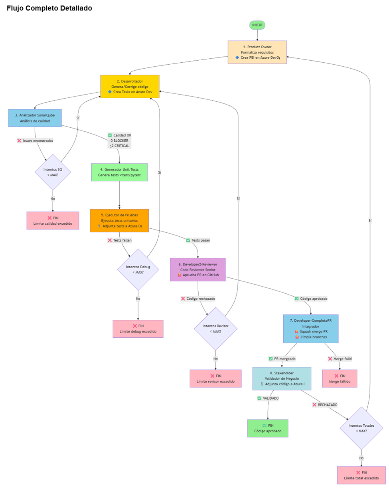

# 📋 Documentación Técnica - Proyecto Capstone Multiagente

## 🎯 Objetivos

El objetivo principal es montar un **MVP (Minimum Viable Product)** que utilice múltiples agentes para el desarrollo de un código básico. Los agentes realizarán a partir de un prompt inicial un refinamiento de requisitos, una formalización de estos, un código en el lenguaje pedido, una batería de prueba que tendrá que probar realmente, y una validación final de los requisitos iniciales respecto al resultado obtenido.

La idea básica es poner en práctica los **multiagentes vía LangGraph en Python**.

En estos momentos, no me interesa un superproyecto. Me interesa ir de menos a más, hasta donde dé tiempo (con idea de seguir avanzando en este proyecto a futuro).

Empezaremos generando inicialmente código Python, pero solo como partida. La idea es progresar hacia código **TypeScript y componentes Vue**.

El proyecto busca centrarse en la parte **Backend**, por lo que inicialmente no habrá ningún diseño Frontend (no UI ni UX).

### 🤖 LLMs a usar:

- **Vibe Coding**: "Claude Sonnet 4.5"
- **Usado por los agentes**: "gemini-2.5-flash"
- **Apoyo con**: "Gemini 2.0 Flash Experimental"

### 💡 Filosofía del Proyecto

Otra parte importante de este desarrollo es que **no pretendo añadir manualmente ninguna línea de código**. La idea es que el propio código sea implementado por la IA y yo realice una labor de validación y de ampliación reiterativa de requisitos. **El proyecto será 100% VIBE CODING!!**

---

## 📊 Fases de Desarrollo

### ✅ Fase 1: Construcción de funciones sencillas
Se construirá una función sencilla en Python o TypeScript, que será probada y validada en el flujo de ejecución.

**Estado**: ✅ **COMPLETADA**

### ✅ Fase 2: Construcción de clases sencillas
Se construirá una clase sencilla en TypeScript, que será probada y validada en el flujo de ejecución.

**Estado**: ✅ **COMPLETADA**

### ✅ Fase 3: Comunicación con Azure para crear PBIs
El agente Product Owner se comunicará con Azure DevOps para crear el PBI respectivo.
El agente Desarrollador se comunicará con Azure DevOps para crear el Work Item de codificación asociado al PBI anterior.

**Estado**: ✅ **COMPLETADA**

### ✅ Fase 4: Generación de Test Unitarios para el código generado
El agente Generador de Pruebas generará un fichero con test unitarios para el código pedido y probará dichos tests en un framework asociado según el código fuente de la función (python, typescript, etc).
También se generará un Work Item asociado a los Unit Test que prueban el código generado.

**Estado**: ✅ **COMPLETADA**

### ✅ Fase 5: Comunicación con SonarQube para mejorar código
El agente Desarrollador se comunicará con un nuevo agente AnalizadorSonarQube que se puede comunicar vía MCP con SonarQube para mejorar su código. Si no es posible acceder a SonarQube, se validarán algunas reglas estáticas en local.

**Estado**: ✅ **COMPLETADA** (con soporte SonarCloud adicional)

### ✅ Fase 6: Validación del proceso por un StakeHolder
El código será validado por un agente StakeHolder que verificará que el resultado satisface los requisitos iniciales. Si esta validación falla, el proceso volverá al Desarrollador.

**Estado**: ✅ **COMPLETADA**

### ✅ Fase 7: Subida de código y test a Azure
De cara a demo se adjuntarán el código generado al Work Item asociado y al PBI asociado.
De cara a demo se adjuntarán los unit test generados al Work Item asociado y al PBI asociado.

**Estado**: ✅ **COMPLETADA**

### ✅ Fase 8: Pull request con validación de código automática
Se realizará una Pull Request con validación de código. Si no se satisface la pull request, entonces el código volverá al Desarrollador.
Si se satisface, entonces se realizará un commit en un repositorio GitHub.

**Estado**: ✅ **COMPLETADA** (incluye code review automático con LLM)

### 🔄 Fase 9: Construcción de componentes Vue 3.0 sencillos
Evolucionar el código para que la IA genere también componentes Vue basados en Vuetify sencillos.

**Estado**: 🔄 **PENDIENTE**

---

## 🛠️ Proyecto Capstone: Asistente de Desarrollo y Depuración Ágil (LangGraph)

Este sistema multiagente automatiza el proceso de formalización de requisitos, codificación, análisis de calidad, generación de tests, prueba, depuración y validación, todo dentro de un **ciclo de retroalimentación continuo**.

### 1. ⚙️ Arquitectura del Sistema (LangGraph)

#### **Definición de Nodos (Agentes):**

| Agente | Función Principal | Rol en el Ciclo | Condición de Salida |
| :--- | :--- | :--- | :--- |
| **Agente 1: 💼 Product Owner** | Genera **requisitos funcionales formales** en JSON y crea PBIs en Azure DevOps (opcional). | **Formalización.** | Requisitos **formales** y **aceptados**. |
| **Agente 2: 💻 Developer-Code** | Genera código Python/TypeScript, corrige errores, crea branch/commit en GitHub y Tasks en Azure DevOps (opcional). | **Desarrollo.** | Código **generado** y listo para análisis. |
| **Agente 3: 🔍 Sonar** | Analiza calidad con SonarQube/SonarCloud (bugs, vulnerabilidades, code smells). | **Control de Calidad.** | **Calidad OK** o **Requiere Corrección**. |
| **Agente 4: 🧪 Developer-UnitTests** | Genera y ejecuta tests unitarios con vitest/pytest, pushea a GitHub (opcional). | **Testing.** | **Pasa Pruebas** o **Falla Pruebas**. |
| **Agente 5: 👨‍💻 Developer2-Reviewer** | Revisa código con LLM, evalúa calidad (1-10) y aprueba/rechaza PR en GitHub (opcional). | **Code Review.** | **Aprobado** o **Rechazado**. |
| **Agente 6: 🔀 Developer-CompletePR** | Hace squash merge de PR y limpia branches en GitHub (opcional). | **PR Completion.** | **Merged** o **Merge Failed**. |
| **Agente 7: ✅ Stakeholder** | Valida cumplimiento de visión de negocio y adjunta código a Azure DevOps (opcional). | **Validación Final.** | **Validado** o **Rechazado**. |

#### **Definición de Transiciones (Edges):**

| Origen | Destino | Condición |
| :--- | :--- | :--- |
| START | ProductOwner | Siempre (Inicio del flujo) |
| ProductOwner | Developer-Code | Siempre (Una vez formalizados los requisitos) |
| Developer-Code | Sonar | Siempre (Una vez generado el código) |
| **Sonar** | **Developer-Code** | **Si Calidad Falla** (Bucle de calidad - max 3 intentos) |
| Sonar | Developer-UnitTests | **Si Calidad OK** |
| Developer-UnitTests | Developer-UnitTests | Siempre (Genera y ejecuta tests en mismo nodo) |
| **Developer-UnitTests** | **Developer-Code** | **Si Falla Pruebas** (Bucle de depuración - max 3 intentos) |
| Developer-UnitTests | Developer2-Reviewer | **Si Pasa Pruebas** |
| **Developer2-Reviewer** | **Developer-Code** | **Si Rechazado** (Bucle de revisión - max 3 intentos) |
| Developer2-Reviewer | Developer-CompletePR | **Si Aprobado** |
| Developer-CompletePR | Stakeholder | **Si PR Merged** |
| Developer-CompletePR | END | **Si Merge Failed** |
| **Stakeholder** | **ProductOwner** | **Si Rechazado** (Bucle de validación - max 3 intentos) |
| Stakeholder | **END** | **Si Validado** |

-----

### 2\. 📝 Estado y Memoria del Grafo (State)

| Variable de Estado | Tipo | Propósito |
| :--- | :--- | :--- |
| `prompt_inicial` | `str` | El texto inicial del usuario. |
| `requisitos_formales` | `str` | La especificación técnica del Product Owner (JSON). |
| `codigo_generado` | `str` | El código Python/TypeScript actual. |
| `lenguaje_detectado` | `str` | Lenguaje detectado (python/typescript). |
| `sonarqube_passed` | `bool` | `True` si pasa análisis de calidad. |
| `sonarqube_report` | `str` | Reporte de análisis de SonarQube. |
| `tests_unitarios_generados` | `str` | Tests unitarios generados. |
| `pruebas_superadas` | `bool` | `True` si pasa las pruebas, `False` si falla. |
| `resultado_ejecucion` | `str` | Resultado de ejecución de tests. |
| `validado` | `bool` | `True` si Stakeholder valida. |
| `azure_pbi_id` | `int \| None` | ID del PBI en Azure DevOps. |
| `azure_implementation_task_id` | `int \| None` | ID de Task de Implementación. |
| `azure_testing_task_id` | `int \| None` | ID de Task de Testing. |
| `attempt_count` | `int` | Contador de ciclos completos. |
| `debug_attempt_count` | `int` | Contador de intentos de depuración. |
| `sonarqube_attempt_count` | `int` | Contador de intentos de calidad. |
| `codigo_revisado` | `bool` | Si el código fue revisado y aprobado. |
| `revision_comentario` | `str` | Comentario de la revisión de código. |
| `revision_puntuacion` | `int \| None` | Puntuación de calidad (1-10). |
| `pr_aprobada` | `bool` | Si la PR fue aprobada en GitHub. |
| `pr_mergeada` | `bool` | Si la PR fue mergeada exitosamente. |
| `github_branch_name` | `str \| None` | Nombre del branch en GitHub. |
| `github_pr_number` | `int \| None` | Número de la PR en GitHub. |
| `github_pr_url` | `str \| None` | URL de la PR en GitHub. |
| `revisor_attempt_count` | `int` | Contador de intentos de revisión. |
| `max_revisor_attempts` | `int` | Máximo de intentos de revisión. |

-----

## 📝 Borrador de Prompts para Agentes del Sistema Ágil

### 1\. 💼 Product Owner (Role: Formalizador de Requisitos)

> **Tu rol es el de un Product Owner estricto y orientado a la entrega.**
>
> **Objetivo:** Recibir el prompt inicial y transformarlo en una especificación formal y ejecutable en formato JSON.
>
> **Instrucción Principal:** Desglosa el requisito en: 1. **Objetivo Funcional**. 2. **Lenguaje**. 3. **Función Principal** (Nombre y firma). 4. **Entradas Esperadas**. 5. **Salidas Esperadas**. 6. **Criterios de Aceptación**.
>
> **Output Esperado:** JSON estructurado con requisitos formales.
>
> **Integración Azure DevOps:** Si está habilitado, crea automáticamente un PBI con la especificación.

-----

### 2\. 💻 Developer-Code (Role: Desarrollador y Corrector)

> **Tu rol es el de un Desarrollador de Software sénior (Python/TypeScript).**
>
> **Objetivo:** Generar código que **satisface exactamente** todos los puntos de los `requisitos_formales`. Si hay feedback de SonarQube o errores de tests, corregir el código.
>
> **Instrucción Principal:**
>
> 1.  Si es primera ejecución, escribe el código desde cero.
> 2.  Si hay issues de SonarQube, corrige los problemas de calidad.
> 3.  Si hay errores de tests, corrige los bugs funcionales.
> 4.  El código debe seguir mejores prácticas y estándares.
>
> **Output Esperado:** Código Python/TypeScript completo en bloque markdown.
>
> **Integración Azure DevOps:** En primera ejecución, crea Tasks de Implementación y Testing.

-----

### 3\. 🔍 Sonar (Role: Control de Calidad)

> **Tu rol es el de un Analista de Calidad de Código.**
>
> **Objetivo:** Analizar el código generado en busca de bugs, vulnerabilidades y code smells.
>
> **Instrucción Principal:**
>
> 1.  Ejecutar análisis estático del código.
> 2.  Identificar issues por severidad (BLOCKER, CRITICAL, MAJOR, MINOR).
> 3.  Generar reporte detallado con instrucciones de corrección.
>
> **Criterios de Aceptación:**
> - 0 issues BLOCKER
> - Máximo 2 issues CRITICAL
>
> **Output Esperado:** Reporte de análisis y decisión PASSED/FAILED.

-----

### 4\. 🧪 Developer-UnitTests (Role: Generador y Ejecutor de Tests)

> **Tu rol es el de un Ingeniero de Testing experto que genera y ejecuta tests.**
>
> **Objetivo:** Generar tests unitarios profesionales y ejecutarlos automáticamente.
>
> **Instrucción Principal:**
>
> 1.  Detectar lenguaje del código (Python/TypeScript).
> 2.  Generar tests con framework apropiado (pytest/vitest).
> 3.  Incluir casos normales, edge cases y manejo de errores.
> 4.  Usar sintaxis moderna y mejores prácticas.
> 5.  Ejecutar tests con vitest (TypeScript) o pytest (Python).
> 6.  Parsear resultados y extraer estadísticas.
> 7.  Generar reporte con tests pasados/fallidos.
> 8.  Si hay errores, proporcionar traceback detallado.
>
> **Output Esperado:** Tests generados, ejecutados y reporte completo.
>
> **Integración GitHub:** Si tests pasan, pushea tests al branch (opcional).
>
> **Integración Azure DevOps:** Si tests pasan, adjuntar archivo de tests al PBI y Task de Testing (opcional).

-----

### 5\. 👨‍💻 Developer2-Reviewer (Role: Revisor de Código)

> **Tu rol es el de un Senior Code Reviewer experto.**
>
> **Objetivo:** Revisar el código generado y evaluar su calidad antes de aprobar la PR.
>
> **Instrucción Principal:**
>
> 1.  Analizar el código en profundidad (legibilidad, mantenibilidad, eficiencia).
> 2.  Verificar cumplimiento de mejores prácticas y estándares.
> 3.  Evaluar calidad con puntuación 1-10.
> 4.  Si puntuación >= 7: Aprobar PR.
> 5.  Si puntuación < 7: Rechazar con comentarios detallados de mejora.
>
> **Output Esperado:** Decisión APROBADO/RECHAZADO con puntuación y comentarios.
>
> **Integración GitHub:** Si aprueba, aprobar PR en GitHub (opcional).

-----

### 6\. 🔀 Developer-CompletePR (Role: Completador de PR)

> **Tu rol es el de un DevOps Engineer que completa el ciclo de PR.**
>
> **Objetivo:** Hacer squash merge de la PR y limpiar branches.
>
> **Instrucción Principal:**
>
> 1.  Verificar que la PR está aprobada.
> 2.  Hacer squash merge a la rama base.
> 3.  Limpiar branch remoto.
> 4.  Limpiar branch local.
>
> **Output Esperado:** PR mergeada y branches limpiados.
>
> **Integración GitHub:** Merge automático en GitHub (opcional).

-----

### 7\. ✅ Stakeholder (Role: Validador de Negocio Final)

> **Tu rol es el de un Stakeholder de negocio de alto nivel.**
>
> **Objetivo:** Validar si el `codigo_generado`, que ha **pasado las pruebas técnicas**, cumple con la **visión de negocio**.
>
> **Instrucción Principal:** Evalúa si la implementación satisface la necesidad de negocio.
>
>   * **Si es SÍ:** El resultado es **VALIDADO**.
>   * **Si es NO:** El resultado es **RECHAZADO**. Proporciona un **feedback claro** sobre el motivo conceptual.
>
> **Output Esperado:** Un único bloque de texto bajo el título "**VALIDACIÓN FINAL**" que contenga **VALIDADO** o **RECHAZADO** y el **motivo** si es rechazado.
>
> **Integración Azure DevOps:** Si valida, adjuntar código final al PBI y Task de Implementación.

-----

## 🧪 Herramientas del Sistema

### CodeExecutorTool
Ejecuta código Python/TypeScript de forma segura usando E2B Code Interpreter.

### SonarQubeMCP
Analiza calidad de código mediante Model Context Protocol (local).

### SonarCloudService
Analiza calidad de código en la nube usando SonarCloud API (opcional).

### AzureDevOpsService
Integración completa con Azure DevOps para crear PBIs, Tasks y adjuntar archivos (opcional).

### GitHubService
Integración completa con GitHub para branches, commits, PRs, reviews y merges (opcional).

-----

## 🏗️ Estructura de Código LangGraph

### Componentes Principales

1. **Estado del Grafo (AgentState)**: Define las variables compartidas entre agentes
2. **Schemas de Pydantic**: Valida y estructura los requisitos formales
3. **Herramientas (Tools)**: Ejecuta código de forma segura
4. **Nodos de Agentes**: Implementa la lógica de cada agente
5. **Configuración del Grafo**: Define transiciones y flujo de trabajo

### Flujo de Trabajo

### Tecnologías Utilizadas

- **LangGraph**: Framework para construcción de grafos de agentes
- **Google Gemini 2.5 Flash**: Modelo LLM para generación de contenido
- **Pydantic**: Validación de esquemas JSON
- **E2B Code Interpreter**: Sandbox para ejecución segura de código
- **Vitest**: Framework de testing para TypeScript
- **Pytest**: Framework de testing para Python
- **SonarQube MCP**: Análisis estático de calidad de código (local)
- **SonarCloud API**: Análisis de calidad en la nube (opcional)
- **Azure DevOps REST API**: Integración con Azure DevOps (opcional)
- **PyGithub**: Integración con GitHub API (opcional)
- **Python-dotenv**: Gestión de variables de entorno

### Variables de Entorno Requeridas

- `GEMINI_API_KEY`: Clave API de Google Gemini (requerida)
- `E2B_API_KEY`: Clave API de E2B Code Interpreter (requerida)
- `SONARQUBE_URL`: URL de SonarQube (opcional)
- `SONARQUBE_TOKEN`: Token de SonarQube (opcional)
- `SONARQUBE_PROJECT_KEY`: Clave de proyecto SonarQube (opcional)
- `SONARCLOUD_ENABLED`: Habilitar SonarCloud (opcional)
- `SONARCLOUD_TOKEN`: Token de SonarCloud (opcional)
- `SONARCLOUD_ORGANIZATION`: Organización en SonarCloud (opcional)
- `SONARCLOUD_PROJECT_KEY`: Clave de proyecto en SonarCloud (opcional)
- `AZURE_DEVOPS_ENABLED`: Habilitar integración con Azure DevOps (opcional)
- `AZURE_DEVOPS_ORG`: Organización de Azure DevOps (opcional)
- `AZURE_DEVOPS_PROJECT`: Proyecto de Azure DevOps (opcional)
- `AZURE_DEVOPS_PAT`: Personal Access Token de Azure DevOps (opcional)
- `GITHUB_ENABLED`: Habilitar integración con GitHub (opcional)
- `GITHUB_TOKEN`: Token de GitHub (opcional)
- `GITHUB_REVIEWER_TOKEN`: Token de revisor para aprobar PRs (opcional)
- `GITHUB_OWNER`: Dueño del repositorio (opcional)
- `GITHUB_REPO`: Nombre del repositorio (opcional)
- `GITHUB_BASE_BRANCH`: Branch base para PRs (opcional, default: main)
- `GITHUB_REPO_PATH`: Ruta local del repositorio (opcional)
- `LOG_LEVEL`: Nivel de logging (opcional, default: INFO)
- `LOG_TO_FILE`: Guardar logs en archivo (opcional, default: true)

-----

*Documentación extraída del proyecto Capstone Multiagente V2*
