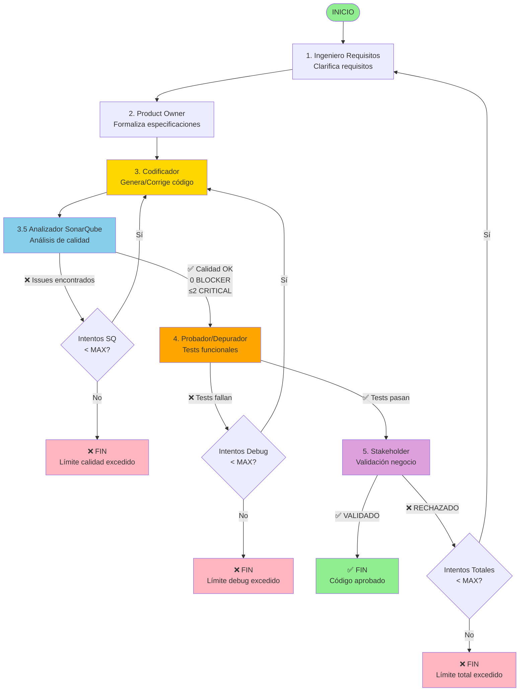

# Diagrama de Flujo del Sistema Multiagente con SonarQube

## 📊 Flujo Completo Detallado



## 🔄 Los Tres Bucles de Corrección

### Bucle A: Calidad de Código (NUEVO)
```
Codificador → SonarQube → [Issues?] → Codificador
                  ↓
              [OK] → Continúa
```
- **Límite**: 2 intentos (configurable)
- **Salida límite**: `QUALITY_LIMIT_EXCEEDED`
- **Verifica**: Bugs, vulnerabilidades, code smells

### Bucle B: Depuración Funcional
```
Codificador → Probador → [Falla?] → Codificador
                  ↓
              [Pasa] → Continúa
```
- **Límite**: 3 intentos (configurable)
- **Salida límite**: `DEBUG_LIMIT_EXCEEDED`
- **Verifica**: Ejecución correcta, tests funcionales

### Bucle C: Validación de Negocio
```
Ing. Requisitos → ... → Stakeholder → [Rechaza?] → Ing. Requisitos
                            ↓
                        [Valida] → FIN
```
- **Límite**: 1 ciclo completo (configurable)
- **Salida límite**: `FAILED_FINAL`
- **Verifica**: Cumplimiento de visión de negocio

## 📈 Orden de Ejecución

### Secuencia Normal (Todo OK)
1. Ingeniero Requisitos → clarifica
2. Product Owner → formaliza
3. Codificador → genera código
4. **SonarQube** → ✅ calidad OK
5. Probador → ✅ tests pasan
6. Stakeholder → ✅ valida
7. ✅ **FIN EXITOSO**

### Escenario con Correcciones de Calidad
1. Ingeniero Requisitos → clarifica
2. Product Owner → formaliza
3. Codificador → genera código (intento 1)
4. **SonarQube** → ❌ 3 CRITICAL issues
5. **Vuelve a Codificador** (intento 2, SQ=1)
6. Codificador → corrige issues
7. **SonarQube** → ✅ 1 CRITICAL issue (aceptable)
8. Probador → ✅ tests pasan
9. Stakeholder → ✅ valida
10. ✅ **FIN EXITOSO**

### Escenario Límite de Calidad Excedido
1. Ingeniero Requisitos → clarifica
2. Product Owner → formaliza
3. Codificador → genera código
4. **SonarQube** → ❌ issues
5. Codificador → corrige (SQ=1)
6. **SonarQube** → ❌ issues persistentes
7. Codificador → corrige (SQ=2)
8. **SonarQube** → ❌ aún hay issues
9. ❌ **FIN - QUALITY_LIMIT_EXCEEDED**

## 🎯 Contadores de Estado

El estado mantiene tres contadores independientes:

```python
state = {
    'attempt_count': 0,          # Ciclo completo (Bucle C)
    'debug_attempt_count': 0,    # Bucle depuración (Bucle B)
    'sonarqube_attempt_count': 0 # Bucle calidad (Bucle A - NUEVO)
}
```

### Reseteo de Contadores

- `attempt_count`: Se incrementa al volver desde Stakeholder
- `debug_attempt_count`: Se resetea cuando tests pasan
- `sonarqube_attempt_count`: Se resetea cuando calidad pasa

## 📊 Archivos Generados

### Nomenclatura
```
{agente}_{tipo}_req{R}_debug{D}_sq{S}.{ext}
```

### Ejemplos
```
1_ingeniero_requisitos_req0.txt
2_product_owner_req0.json
3_codificador_req0_debug0_sq0.py
3_codificador_req0_debug0_sq1.py    ← 1ra corrección calidad
3_codificador_req0_debug0_sq2.py    ← 2da corrección calidad
3.5_sonarqube_report_req0_sq0.txt
3.5_sonarqube_report_req0_sq1.txt
3.5_sonarqube_instrucciones_req0_sq1.txt
4_probador_tests_req0_debug0.txt
4_probador_resultado_req0_debug0.json
5_stakeholder_validacion_req0.txt
codigo_final.py
```

## 🔧 Configuración de Límites

```python
# En src/config/settings.py

MAX_ATTEMPTS = 1              # Ciclos completos
MAX_DEBUG_ATTEMPTS = 3        # Intentos de depuración
MAX_SONARQUBE_ATTEMPTS = 2    # Intentos de calidad ← NUEVO
```

## 🚦 Estados de Salida

### Salidas Exitosas
- ✅ `VALIDADO` - Código completamente aprobado

### Salidas de Límite
- ❌ `QUALITY_LIMIT_EXCEEDED` - Calidad no alcanzada
- ❌ `DEBUG_LIMIT_EXCEEDED` - Tests no pasan
- ❌ `FAILED_FINAL` - Validación de negocio fallida

## 💡 Ventajas del Nuevo Flujo

### Antes (sin SonarQube)
```
Codificador → Probador
```
- ⚠️ Issues de calidad solo detectados manualmente
- ⚠️ Code smells pasan desapercibidos
- ⚠️ Vulnerabilidades no detectadas

### Ahora (con SonarQube)
```
Codificador → SonarQube → Probador
```
- ✅ Detección automática de issues
- ✅ Código más seguro
- ✅ Mejor mantenibilidad
- ✅ Estándares profesionales
- ✅ Reducción de deuda técnica
