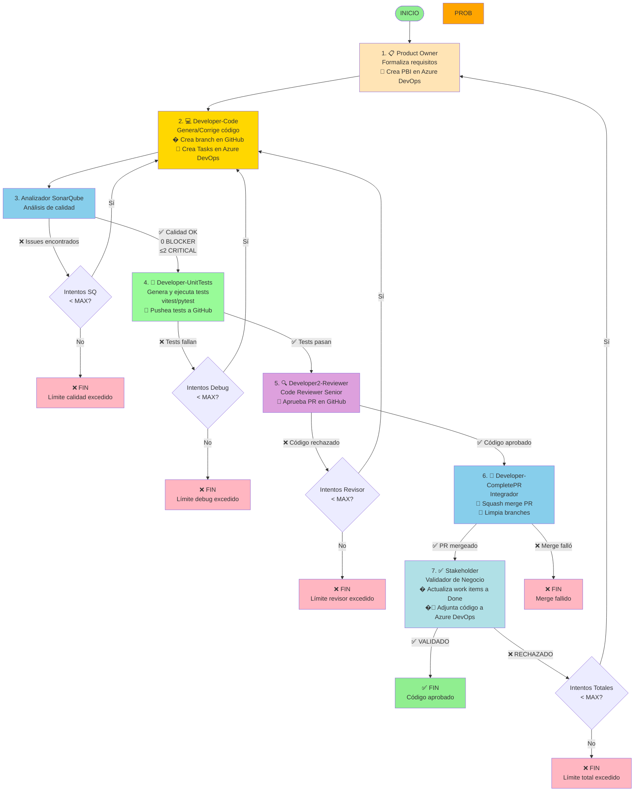

# Diagrama de Flujo del Sistema Multiagente con SonarQube

## 🎭 Roles de los Agentes

| Agente | Rol y Funcionalidades Principales | Especialización | Integración Externa |
|--------|-----------------------------------|----------------|---------------------|
| **📋 ProductOwner** | **Analista de Requisitos**<br/>• Formaliza requisitos en JSON estructurado<br/>• Valida completitud y claridad<br/>• Gestiona feedback del Stakeholder<br/>🔷 **Azure DevOps:** Crea PBIs | Análisis de requisitos | Azure DevOps (PBIs) |
| **💻 Developer-Code** | **Desarrollador Principal**<br/>• Genera código Python/TypeScript<br/>• Corrige errores de ejecución<br/>• Corrige issues de calidad (SonarQube)<br/>🐙 **GitHub:** Crea branch y pushea código<br/>🔷 **Azure DevOps:** Crea Tasks de implementación y testing | Desarrollo de código | GitHub (branches) + Azure DevOps |
| **🔍 SonarQube** | **Analista de Calidad**<br/>• Analiza bugs, vulnerabilidades, code smells<br/>• Genera reportes detallados<br/>• Polling inteligente (hasta 5 min)<br/>☁️ **SonarCloud:** Consulta análisis del branch<br/>🔷 **Azure DevOps:** Comenta en Tasks | Calidad de código | SonarCloud API + Azure DevOps |
| **🧪 Developer-UnitTests** | **Ingeniero de Testing**<br/>• Genera tests (vitest/pytest)<br/>• Ejecuta tests con timeout<br/>• Corrige tests fallidos (max 3 intentos)<br/>🐙 **GitHub:** Pushea tests y crea PR | Testing y QA | GitHub (tests + PR) |
| **🔍 Developer2-Reviewer** | **Code Reviewer Senior**<br/>• Revisa legibilidad y mantenibilidad<br/>• Valida cumplimiento de requisitos<br/>• Identifica aspectos a mejorar<br/>🐙 **GitHub:** Aprueba PR automáticamente | Code review | GitHub (aprobación PR) |
| **🔀 Developer-CompletePR** | **Integrador**<br/>• Verifica precondiciones (tests + aprobación)<br/>• Squash merge del PR<br/>• Limpia branches remotos y locales<br/>🐙 **GitHub:** Merge + cleanup branches | Integración y merge | GitHub (merge + cleanup) |
| **✅ Stakeholder** | **Validador de Negocio**<br/>• Valida visión de negocio<br/>• Verifica alineación con requisitos<br/>• Decide completitud del proyecto<br/>🔷 **Azure DevOps:** Adjunta código final a PBI | Validación de negocio | Azure DevOps (adjuntos) |

## Flujo Completo Detallado



## Los Cuatro Bucles de Corrección

### Bucle 1: Calidad de Código (Sonar ↔ Developer-Code)
```
Developer-Code → Sonar → [Issues?] → Developer-Code
                  ↓
              [OK] → Developer-UnitTests → Continúa
```
- **Trigger**: Código con issues críticos de SonarQube (BLOCKER/CRITICAL)
- **Límite**: `MAX_SONARQUBE_ATTEMPTS` = 3 intentos (configurable)
- **Salida límite**: `QUALITY_LIMIT_EXCEEDED`
- **Verifica**: Bugs, vulnerabilidades, code smells, complejidad
- **Proceso**: 
  1. Sonar analiza código con sonar-scanner.bat o SonarCloud
  2. Si detecta issues → genera instrucciones de corrección
  3. Developer-Code corrige según instrucciones
  4. Vuelve a Sonar para nuevo análisis
- **Importante**: Cada corrección pasa por Sonar nuevamente

### Bucle 2: Depuración Funcional (Developer-UnitTests ↔ Developer-Code)
```
Developer-UnitTests → [Tests fallan?] → Developer-Code → Sonar → Developer-UnitTests
         ↓
     [Pasan] → Developer2-Reviewer
```
- **Trigger**: Tests unitarios fallan
- **Límite**: `MAX_DEBUG_ATTEMPTS` = 3 intentos (configurable)
- **Salida límite**: `DEBUG_LIMIT_EXCEEDED`
- **Verifica**: Ejecución correcta de tests unitarios
- **Frameworks**: vitest para TypeScript, pytest para Python
- **Proceso**:
  1. Developer-UnitTests genera y ejecuta tests
  2. Si fallan → captura traceback y estadísticas
  3. Developer-Code corrige basándose en el error
  4. Código corregido pasa por Sonar → Developer-UnitTests
- **Reportes**: Estadísticas detalladas (total, pasados, fallidos)
- **Ejecución**: Directa con subprocess (sin sandbox, ~3x más rápido)

### Bucle 3: Revisión de Código (Developer2-Reviewer ↔ Developer-Code)
```
Developer2-Reviewer → [Rechaza?] → Developer-Code → Sonar → Developer-UnitTests → Developer2-Reviewer
         ↓
     [Aprueba] → Developer-CompletePR
```
- **Trigger**: Revisor rechaza el código por problemas de diseño/arquitectura
- **Límite**: `MAX_REVISOR_ATTEMPTS` = 2 intentos (configurable)
- **Salida límite**: `REVISOR_LIMIT_EXCEEDED`
- **Verifica**: Legibilidad, mantenibilidad, buenas prácticas, arquitectura
- **Proceso**:
  1. Developer2-Reviewer analiza código con LLM
  2. Si rechaza → genera feedback detallado
  3. Developer-Code aplica mejoras según feedback
  4. Código mejorado pasa por Sonar → Developer-UnitTests → Developer2-Reviewer
- **GitHub**: Aprueba PR automáticamente con token de revisor (requiere token diferente al que crea el PR)

### Bucle 4: Validación de Negocio (Stakeholder ↔ Product Owner)
```
Product Owner → ... → Stakeholder → [Rechaza?] → Product Owner
                            ↓
                        [Valida] → FIN
```
- **Límite**: `MAX_ATTEMPTS` = 1 ciclo completo (configurable)
- **Salida límite**: `FAILED_FINAL`
- **Verifica**: Cumplimiento de visión de negocio

## Contadores de Estado

El estado mantiene cuatro contadores independientes:

```python
state = {
    'attempt_count': 0,           # Ciclo completo (Bucle 4)
    'debug_attempt_count': 0,     # Bucle depuración (Bucle 2)
    'sonarqube_attempt_count': 0, # Bucle calidad (Bucle 1)
    'revisor_attempt_count': 0    # Bucle revisión (Bucle 3)
}
```

### Reseteo de Contadores

- `attempt_count`: Se incrementa al volver desde Stakeholder a Product Owner
- `debug_attempt_count`: Se resetea cuando tests pasan
- `sonarqube_attempt_count`: Se resetea cuando calidad pasa
- `revisor_attempt_count`: Se resetea cuando revisor aprueba el código

## Archivos Generados

### Nomenclatura
```
{agente}_{tipo}_req{R}_debug{D}_sq{S}.{ext}
```

### Ejemplos
```
2_desarrollador_req0_debug0_sq1.ts    ← 1ra corrección calidad
2_desarrollador_req0_debug1_sq0.ts    ← 1ra corrección después de test fallido
3_sonarqube_report_req0_sq0.txt
3_sonarqube_report_req0_sq1.txt
3_sonarqube_instrucciones_req0_sq1.txt
unit_tests_req0_sq1.test.ts          ← Tests generados (vitest)
4_testing_req0_debug0_PASSED.txt     ← Resultado ejecución tests
4_testing_req0_debug1_FAILED.txt     ← Tests fallidos con estadísticas
5_reviewer_feedback_req0.txt         ← Feedback del revisor (si rechaza)
6_stakeholder_validacion_req0.txt
codigo_final.ts
```

## Configuración de Límites

```python
# En src/config/settings.py

MAX_ATTEMPTS = 1              # Ciclos completos (Product Owner → Stakeholder)
MAX_DEBUG_ATTEMPTS = 3        # Intentos de depuración (Developer-UnitTests ↔ Developer-Code)
MAX_SONARQUBE_ATTEMPTS = 3    # Intentos de calidad (Sonar ↔ Developer-Code)
MAX_REVISOR_ATTEMPTS = 2      # Intentos de revisión (Developer2-Reviewer ↔ Developer-Code)
```

## Estados de Salida

### Salidas Exitosas
- ✅ `VALIDADO` - Código completamente aprobado

### Salidas de Límite
- ❌ `QUALITY_LIMIT_EXCEEDED` - Calidad no alcanzada después de MAX_SONARQUBE_ATTEMPTS
- ❌ `DEBUG_LIMIT_EXCEEDED` - Tests no pasan después de MAX_DEBUG_ATTEMPTS
- ❌ `REVISOR_LIMIT_EXCEEDED` - Código no aprobado después de MAX_REVISOR_ATTEMPTS
- ❌ `FAILED_FINAL` - Validación de negocio fallida después de MAX_ATTEMPTS

## Ventajas del Nuevo Flujo

### Antes (sin SonarQube)
```
Desarrollador → Probador
```
- ⚠️ Issues de calidad solo detectados manualmente
- ⚠️ Code smells pasan desapercibidos
- ⚠️ Vulnerabilidades no detectadas

### Ahora (con SonarQube, Tests Modernos, Code Review y GitHub)
```
Developer-Code → Sonar → Developer-UnitTests → Developer2-Reviewer → Developer-CompletePR → Stakeholder
```
- ✅ Detección automática de issues de calidad
- ✅ Código más seguro y mantenible
- ✅ Tests profesionales con vitest/pytest
- ✅ Ejecución directa sin sandbox (~3x más rápido)
- ✅ Estadísticas detalladas (total, pasados, fallidos)
- ✅ Output limpio sin códigos ANSI
- ✅ Code review automatizado con LLM
- ✅ Integración completa con GitHub (branches, commits, PRs, merge)
- ✅ Integración completa con Azure DevOps (PBIs, Tasks, comentarios, adjuntos)
- ✅ Estándares profesionales en todo el flujo
- ✅ Reducción de deuda técnica
- ✅ Trazabilidad completa del código