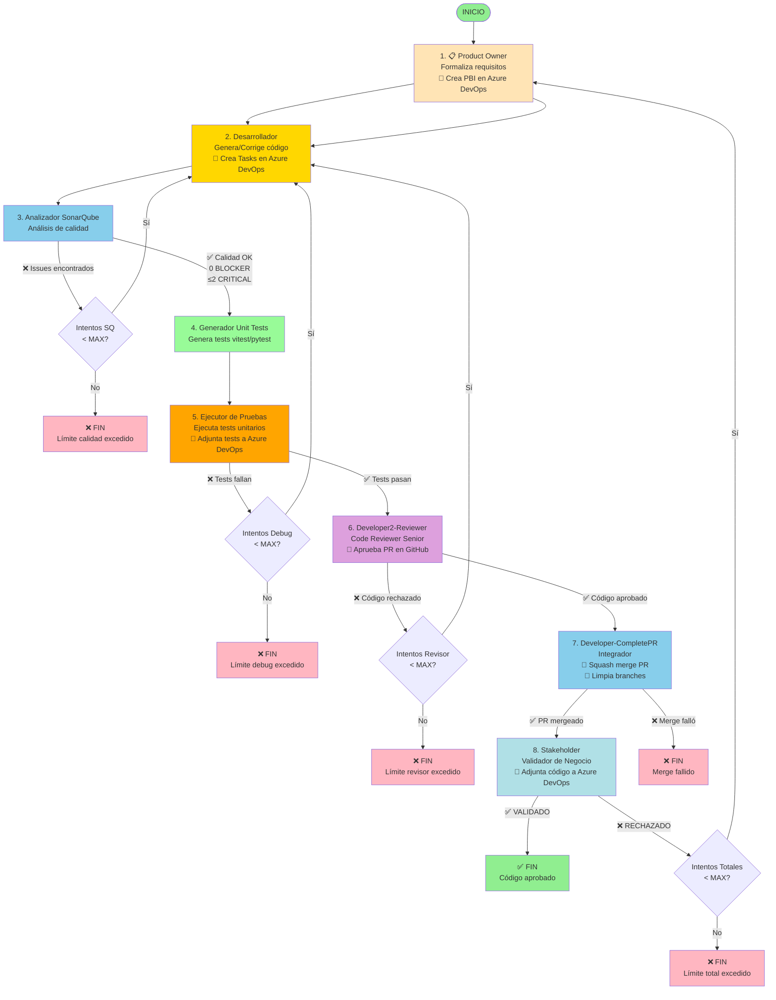

# Diagrama de Flujo del Sistema Multiagente con SonarQube

## 🎭 Roles de los Agentes

| Agente | Rol y Funcionalidades Principales | Especialización | Integración Externa |
|--------|-----------------------------------|----------------|---------------------|
| **📋 ProductOwner** | **Analista de Requisitos**<br/>• Formaliza requisitos en JSON estructurado<br/>• Valida completitud y claridad<br/>• Gestiona feedback del Stakeholder<br/>🔷 **Azure DevOps:** Crea PBIs | Análisis de requisitos | Azure DevOps (PBIs) |
| **💻 Developer-Code** | **Desarrollador Principal**<br/>• Genera código Python/TypeScript<br/>• Corrige errores de ejecución<br/>• Corrige issues de calidad (SonarQube)<br/>🐙 **GitHub:** Crea branch y pushea código<br/>🔷 **Azure DevOps:** Crea Tasks de implementación y testing | Desarrollo de código | GitHub (branches) + Azure DevOps |
| **🔍 SonarQube** | **Analista de Calidad**<br/>• Analiza bugs, vulnerabilidades, code smells<br/>• Genera reportes detallados<br/>• Polling inteligente (hasta 5 min)<br/>☁️ **SonarCloud:** Consulta análisis del branch<br/>🔷 **Azure DevOps:** Comenta en Tasks | Calidad de código | SonarCloud API + Azure DevOps |
| **🧪 Developer-UnitTests** | **Ingeniero de Testing**<br/>• Genera tests (vitest/pytest)<br/>• Ejecuta tests con timeout<br/>• Corrige tests fallidos (max 3 intentos)<br/>🐙 **GitHub:** Pushea tests y crea PR | Testing y QA | GitHub (tests + PR) |
| **🔍 Developer2-Reviewer** | **Code Reviewer Senior**<br/>• Revisa legibilidad y mantenibilidad<br/>• Valida cumplimiento de requisitos<br/>• Identifica aspectos a mejorar<br/>🐙 **GitHub:** Aprueba PR automáticamente | Code review | GitHub (aprobación PR) |
| **🔀 Developer-CompletePR** | **Integrador**<br/>• Verifica precondiciones (tests + aprobación)<br/>• Squash merge del PR<br/>• Limpia branches remotos y locales<br/>🐙 **GitHub:** Merge + cleanup branches | Integración y merge | GitHub (merge + cleanup) |
| **✅ Stakeholder** | **Validador de Negocio**<br/>• Valida visión de negocio<br/>• Verifica alineación con requisitos<br/>• Decide completitud del proyecto<br/>🔷 **Azure DevOps:** Adjunta código final a PBI | Validación de negocio | Azure DevOps (adjuntos) |

## Flujo Completo Detallado



## Los Cuatro Bucles de Corrección

### Bucle A: Calidad de Código
```
Desarrollador → SonarQube → [Issues?] → Desarrollador
                  ↓
              [OK] → Generador Unit Tests → Continúa
```
- **Límite**: 3 intentos (configurable)
- **Salida límite**: `QUALITY_LIMIT_EXCEEDED`
- **Verifica**: Bugs, vulnerabilidades, code smells
- **Genera**: Tests unitarios con vitest (TypeScript) o pytest (Python)
- **Ejecuta**: Tests directamente sin sandbox (mejora de performance)

### Bucle B: Depuración Funcional
```
Generador Unit Tests → Ejecutor de Pruebas → [Falla?] → Codificador
                            ↓
                        [Pasa] → Continúa
```
- **Límite**: 3 intentos (configurable)
- **Salida límite**: `DEBUG_LIMIT_EXCEEDED`
- **Verifica**: Ejecución correcta de tests unitarios
- **Frameworks**: vitest para TypeScript, pytest para Python
- **Reportes**: Estadísticas detalladas (total, pasados, fallidos)

### Bucle C: Revisión de Código
```
Developer2-Reviewer → [Rechaza?] → Developer-Code
                ↓
            [Aprueba] → Developer-CompletePR
```
- **Límite**: 2 intentos (configurable)
- **Salida límite**: `REVISOR_LIMIT_EXCEEDED`
- **Verifica**: Legibilidad, mantenibilidad, buenas prácticas
- **GitHub**: Aprueba PR automáticamente con token de revisor

### Bucle D: Validación de Negocio
```
Product Owner → ... → Stakeholder → [Rechaza?] → Product Owner
                            ↓
                        [Valida] → FIN
```
- **Límite**: 1 ciclo completo (configurable)
- **Salida límite**: `FAILED_FINAL`
- **Verifica**: Cumplimiento de visión de negocio

## Contadores de Estado

El estado mantiene tres contadores independientes:

```python
state = {
    'attempt_count': 0,          # Ciclo completo (Bucle C)
    'debug_attempt_count': 0,    # Bucle depuración (Bucle B)
    'sonarqube_attempt_count': 0 # Bucle calidad (Bucle A - NUEVO)
}
```

### Reseteo de Contadores

- `attempt_count`: Se incrementa al volver desde Stakeholder
- `debug_attempt_count`: Se resetea cuando tests pasan
- `sonarqube_attempt_count`: Se resetea cuando calidad pasa

## Archivos Generados

### Nomenclatura
```
{agente}_{tipo}_req{R}_debug{D}_sq{S}.{ext}
```

### Ejemplos
```
1_product_owner_req0.json
2_desarrollador_req0_debug0_sq0.ts
2_desarrollador_req0_debug0_sq1.ts    ← 1ra corrección calidad
2_desarrollador_req0_debug1_sq0.ts    ← 1ra corrección después de test fallido
3_sonarqube_report_req0_sq0.txt
3_sonarqube_report_req0_sq1.txt
3_sonarqube_instrucciones_req0_sq1.txt
unit_tests_req0_sq1.test.ts          ← Tests generados (vitest)
5_probador_req0_debug0_PASSED.txt    ← Resultado ejecución tests
5_probador_req0_debug1_FAILED.txt    ← Tests fallidos con estadísticas
6_stakeholder_validacion_req0.txt
codigo_final.ts
```

## Configuración de Límites

```python
# En src/config/settings.py

MAX_ATTEMPTS = 1              # Ciclos completos
MAX_DEBUG_ATTEMPTS = 3        # Intentos de depuración
MAX_SONARQUBE_ATTEMPTS = 3    # Intentos de calidad
```

## Estados de Salida

### Salidas Exitosas
- ✅ `VALIDADO` - Código completamente aprobado

### Salidas de Límite
- ❌ `QUALITY_LIMIT_EXCEEDED` - Calidad no alcanzada
- ❌ `DEBUG_LIMIT_EXCEEDED` - Tests no pasan
- ❌ `FAILED_FINAL` - Validación de negocio fallida

## Ventajas del Nuevo Flujo

### Antes (sin SonarQube)
```
Desarrollador → Probador
```
- ⚠️ Issues de calidad solo detectados manualmente
- ⚠️ Code smells pasan desapercibidos
- ⚠️ Vulnerabilidades no detectadas

### Ahora (con SonarQube y Tests Modernos)
```
Desarrollador → SonarQube → Generador Tests → Ejecutor Pruebas
```
- ✅ Detección automática de issues
- ✅ Código más seguro y mantenible
- ✅ Tests profesionales con vitest/pytest
- ✅ Ejecución directa sin sandbox (~3x más rápido)
- ✅ Estadísticas detalladas (total, pasados, fallidos)
- ✅ Output limpio sin códigos ANSI
- ✅ Estándares profesionales
- ✅ Reducción de deuda técnica
- ✅ Integración con Azure DevOps (PBIs, Tasks, adjuntos)