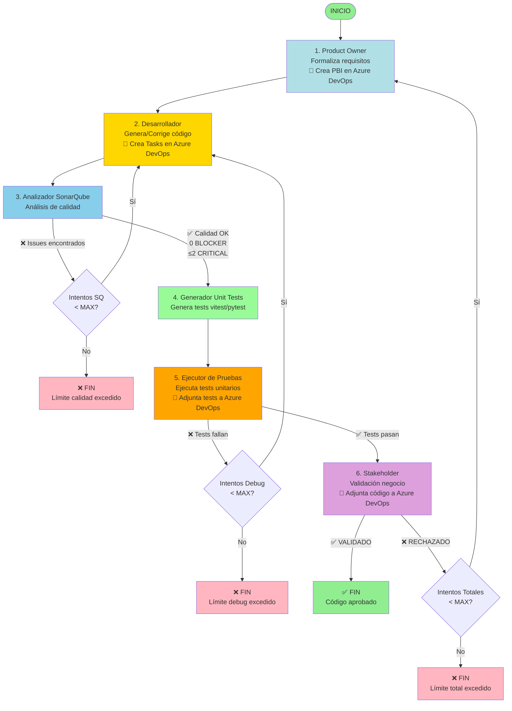

# Diagrama de Flujo del Sistema Multiagente con SonarQube

## Flujo Completo Detallado



## Los Tres Bucles de Corrección

### Bucle A: Calidad de Código
```
Desarrollador → SonarQube → [Issues?] → Desarrollador
                  ↓
              [OK] → Generador Unit Tests → Ejecutor Pruebas → Continúa
```
- **Límite**: 3 intentos (configurable)
- **Salida límite**: `QUALITY_LIMIT_EXCEEDED`
- **Verifica**: Bugs, vulnerabilidades, code smells
- **Genera**: Tests unitarios con vitest (TypeScript) o pytest (Python)
- **Ejecuta**: Tests directamente sin sandbox (mejora de performance)
### Bucle B: Depuración Funcional
```
Generador Unit Tests → Ejecutor Pruebas → [Falla?] → Codificador
                            ↓
                        [Pasa] → Continúa
```
- **Límite**: 3 intentos (configurable)
- **Salida límite**: `DEBUG_LIMIT_EXCEEDED`
- **Verifica**: Ejecución correcta de tests unitarios
- **Frameworks**: vitest para TypeScript, pytest para Python
- **Reportes**: Estadísticas detalladas (total, pasados, fallidos)
- **Verifica**: Ejecución correcta, tests funcionales

### Bucle C: Validación de Negocio
```
Product Owner → ... → Stakeholder → [Rechaza?] → Product Owner
                            ↓
                        [Valida] → FIN
```
- **Límite**: 1 ciclo completo (configurable)
- **Salida límite**: `FAILED_FINAL`
- **Verifica**: Cumplimiento de visión de negocio
### Secuencia Normal (Todo OK)
1. Product Owner → formaliza requisitos + 🔷 crea PBI
2. Desarrollador → genera código + 🔷 crea Tasks
3. **SonarQube** → ✅ calidad OK
4. **Generador Unit Tests** → genera tests (vitest/pytest)
5. **Ejecutor Pruebas** → ✅ tests pasan (estadísticas: 40/40) + 📎 adjunta tests
6. Stakeholder → ✅ valida + 📎 adjunta código final
7. ✅ **FIN EXITOSO**
### Escenario con Correcciones de Calidad
1. Product Owner → formaliza
2. Desarrollador → genera código (intento 1)
3. **SonarQube** → ❌ 3 CRITICAL issues
4. **Vuelve a Desarrollador** (intento 2, SQ=1)
5. Desarrollador → corrige issues
6. **SonarQube** → ✅ 1 CRITICAL issue (aceptable)
7. **Generador Unit Tests** → genera tests
8. **Ejecutor Pruebas** → ✅ tests pasan
9. Stakeholder → ✅ valida
10. ✅ **FIN EXITOSO**
### Escenario Límite de Calidad Excedido
1. Product Owner → formaliza
2. Desarrollador → genera código
3. **SonarQube** → ❌ issues
4. Desarrollador → corrige (SQ=1)
5. **SonarQube** → ❌ issues persistentes
6. Desarrollador → corrige (SQ=2)
7. **SonarQube** → ❌ issues persistentes
8. Desarrollador → corrige (SQ=3)
9. **SonarQube** → ❌ aún hay issues
10. ❌ **FIN - QUALITY_LIMIT_EXCEEDED**

## Contadores de Estado

El estado mantiene tres contadores independientes:

```python
state = {
    'attempt_count': 0,          # Ciclo completo (Bucle C)
    'debug_attempt_count': 0,    # Bucle depuración (Bucle B)
    'sonarqube_attempt_count': 0 # Bucle calidad (Bucle A - NUEVO)
}
```

### Reseteo de Contadores

- `attempt_count`: Se incrementa al volver desde Stakeholder
- `debug_attempt_count`: Se resetea cuando tests pasan
- `sonarqube_attempt_count`: Se resetea cuando calidad pasa

## Archivos Generados

### Nomenclatura
```
{agente}_{tipo}_req{R}_debug{D}_sq{S}.{ext}
```

### Ejemplos
```
1_product_owner_req0.json
2_desarrollador_req0_debug0_sq0.ts
2_desarrollador_req0_debug0_sq1.ts    ← 1ra corrección calidad
2_desarrollador_req0_debug1_sq0.ts    ← 1ra corrección después de test fallido
3_sonarqube_report_req0_sq0.txt
3_sonarqube_report_req0_sq1.txt
3_sonarqube_instrucciones_req0_sq1.txt
unit_tests_req0_sq1.test.ts          ← Tests generados (vitest)
5_probador_req0_debug0_PASSED.txt    ← Resultado ejecución tests
5_probador_req0_debug1_FAILED.txt    ← Tests fallidos con estadísticas
6_stakeholder_validacion_req0.txt
codigo_final.ts
```

## Configuración de Límites

```python
# En src/config/settings.py

MAX_ATTEMPTS = 1              # Ciclos completos
MAX_DEBUG_ATTEMPTS = 3        # Intentos de depuración
MAX_SONARQUBE_ATTEMPTS = 3    # Intentos de calidad
```

## Estados de Salida

### Salidas Exitosas
- ✅ `VALIDADO` - Código completamente aprobado

### Salidas de Límite
- ❌ `QUALITY_LIMIT_EXCEEDED` - Calidad no alcanzada
- ❌ `DEBUG_LIMIT_EXCEEDED` - Tests no pasan
- ❌ `FAILED_FINAL` - Validación de negocio fallida

## Ventajas del Nuevo Flujo

### Antes (sin SonarQube)
```
Desarrollador → Probador
```
- ⚠️ Issues de calidad solo detectados manualmente
- ⚠️ Code smells pasan desapercibidos
- ⚠️ Vulnerabilidades no detectadas

### Ahora (con SonarQube y Tests Modernos)
```
Desarrollador → SonarQube → Generador Tests → Ejecutor Pruebas
```
- ✅ Detección automática de issues
- ✅ Código más seguro y mantenible
- ✅ Tests profesionales con vitest/pytest
- ✅ Ejecución directa sin sandbox (~3x más rápido)
- ✅ Estadísticas detalladas (total, pasados, fallidos)
- ✅ Output limpio sin códigos ANSI
- ✅ Estándares profesionales
- ✅ Reducción de deuda técnica
- ✅ Integración con Azure DevOps (PBIs, Tasks, adjuntos)