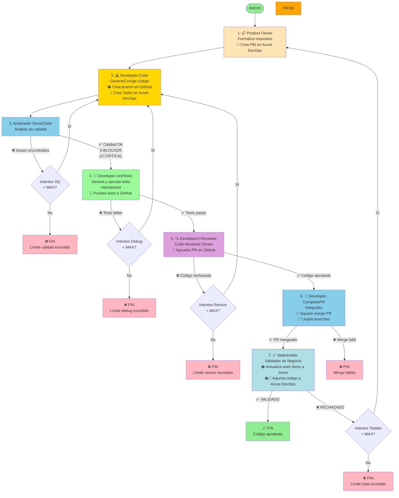

# Capstone Proyecto Multiagente - Sistema de Desarrollo Ágil

Sistema multiagente para desarrollo automatizado de código Python y TypeScript usando LangGraph y Google Gemini.

## 🎯 Objetivos y Filosofía del Proyecto

### Objetivo Principal

El objetivo principal es montar un **MVP (Minimum Viable Product)** que utilice múltiples agentes para el desarrollo de un código básico. Los agentes realizarán a partir de un prompt inicial:

- ✅ Refinamiento de requisitos
- ✅ Formalización de especificaciones técnicas
- ✅ Generación de código en el lenguaje solicitado
- ✅ Análisis de calidad con SonarQube/SonarCloud
- ✅ Batería de pruebas unitarias que se ejecutan realmente
- ✅ Revisión de código automatizada
- ✅ Validación final de requisitos vs resultado obtenido

### Filosofía: 100% VIBE CODING

**No se añade manualmente ninguna línea de código**. La idea es que el propio código sea implementado por la IA y el desarrollador realice una labor de validación y de ampliación iterativa de requisitos.

### LLMs Utilizados

- **Vibe Coding**: Claude Sonnet 4.5
- **Usado por los agentes**: Gemini 2.5 Flash, Gemini 3 flash-preview

### Alcance del Proyecto

- **Enfoque Backend**: Sin diseño Frontend (no UI ni UX)
- **Lenguajes**: Python y TypeScript (con progresión futura hacia componentes Vue)
- **Metodología**: Desarrollo iterativo de menos a más
- **Integración**: Azure DevOps y GitHub para trazabilidad completa

## 📊 Roadmap - Fases de Desarrollo

### ✅ Fase 1: Construcción de funciones sencillas
Se construirá una función sencilla en Python o TypeScript, que será probada y validada en el flujo de ejecución.

**Estado**: ✅ **COMPLETADA**

### ✅ Fase 2: Construcción de clases sencillas
Se construirá una clase sencilla en TypeScript, que será probada y validada en el flujo de ejecución.

**Estado**: ✅ **COMPLETADA**

### ✅ Fase 3: Comunicación con Azure para crear PBIs
El agente Product Owner se comunicará con Azure DevOps para crear el PBI respectivo.
El agente Desarrollador se comunicará con Azure DevOps para crear el Work Item de codificación asociado al PBI anterior.

**Estado**: ✅ **COMPLETADA**

### ✅ Fase 4: Generación de Test Unitarios para el código generado
El agente Generador de Pruebas generará un fichero con test unitarios para el código pedido y probará dichos tests en un framework asociado según el código fuente de la función (python, typescript, etc).
También se generará un Work Item asociado a los Unit Test que prueban el código generado.

**Estado**: ✅ **COMPLETADA**

### ✅ Fase 5: Comunicación con SonarQube para mejorar código
El agente Desarrollador se comunicará con un nuevo agente AnalizadorSonarQube que se puede comunicar vía MCP con SonarQube para mejorar su código. Si no es posible acceder a SonarQube, se validarán algunas reglas estáticas en local.

**Estado**: ✅ **COMPLETADA** (con soporte SonarCloud adicional)

### ✅ Fase 6: Validación del proceso por un StakeHolder
El código será validado por un agente StakeHolder que verificará que el resultado satisface los requisitos iniciales. Si esta validación falla, el proceso volverá al Desarrollador.

**Estado**: ✅ **COMPLETADA**

### ✅ Fase 7: Subida de código y test a Azure
De cara a demo se adjuntarán el código generado al Work Item asociado y al PBI asociado.
De cara a demo se adjuntarán los unit test generados al Work Item asociado y al PBI asociado.

**Estado**: ✅ **COMPLETADA**

### ✅ Fase 8: Pull request con validación de código automática
Se realizará una Pull Request con validación de código. Si no se satisface la pull request, entonces el código volverá al Desarrollador.
Si se satisface, entonces se realizará un commit en un repositorio GitHub.

**Estado**: ✅ **COMPLETADA** (incluye code review automático con LLM)

### 🔄 Fase 9: Construcción de componentes Vue 3.0 sencillos
Evolucionar el código para que la IA genere también componentes Vue basados en Vuetify sencillos.

**Estado**: 🔄 **PENDIENTE**

## 📁 Estructura del Proyecto

```
Capstone proyect v2/
├── src/
│   ├── __init__.py
│   ├── main.py                      # Punto de entrada principal
│   │
│   ├── config/                      # Configuración
│   │   ├── __init__.py
│   │   ├── settings.py              # Variables de entorno y RetryConfig
│   │   └── prompts.py               # Prompts centralizados de agentes
│   │
│   ├── models/                      # Modelos de datos
│   │   ├── __init__.py
│   │   ├── state.py                 # AgentState (TypedDict)
│   │   └── schemas.py               # Schemas Pydantic
│   │
│   ├── tools/                       # Herramientas
│   │   ├── __init__.py
│   │   ├── sonarqube_mcp.py         # Integración con SonarQube MCP
│   │   ├── azure_devops_integration.py  # 🔷 Cliente de Azure DevOps API
│   │   └── file_utils.py            # Utilidades de archivos y detección de lenguaje
│   │
│   ├── agents/                      # Agentes del sistema
│   │   ├── __init__.py
│   │   ├── product_owner.py         # Agente 1: Formalización de requisitos
│   │   ├── developer_code.py        # Agente 2: Desarrollo y corrección de código
│   │   ├── sonar.py                 # Agente 3: Análisis de calidad con SonarQube
│   │   ├── developer_unit_tests.py  # Agente 4: Tests + Agente 6: CompletePR
│   │   ├── developer2_reviewer.py   # Agente 5: Revisión de código y aprobación de PR
│   │   └── stakeholder.py           # Agente 7: Validación final de negocio
│   │
│   ├── llm/                         # Cliente LLM
│   │   ├── __init__.py
│   │   └── gemini_client.py         # Cliente Gemini
│   │
│   ├── utils/                       # Utilidades
│   │   ├── __init__.py
│   │   ├── logger.py                # Sistema de logging
│   │   └── file_manager.py          # Gestión de archivos
│   │
│   ├── services/                    # Servicios auxiliares
│   │   ├── __init__.py
│   │   ├── github_service.py        # Integración con GitHub
│   │   ├── azure_devops_service.py  # Servicio de Azure DevOps
│   │   └── sonarcloud_service.py    # Servicio de SonarCloud
│   │
│   └── workflow/                    # Workflow LangGraph
│       ├── __init__.py
│       └── graph.py                 # Configuración del grafo
│
├── output/                          # Salidas generadas
├── .env                             # Variables de entorno
├── .env.example                     # Ejemplo de variables de entorno
├── requirements.txt
├── sonar-project.properties.example # Ejemplo de configuración SonarQube
├── DOCUMENTACION.md
└── README.md
```

## 🚀 Instalación

1. **Clonar el repositorio**

2. **Crear entorno virtual**

```bash
python -m venv .venv
.venv\Scripts\activate  # Windows
```

3. **Instalar dependencias**

```bash
pip install -r requirements.txt
```

**Para testing (requerido):**

```bash
# TypeScript - Instalar en directorio output/
cd output
npm install -D vitest
cd ..

# Python
pip install pytest
```

**Nota:** El sistema crea automáticamente `package.json` en `output/` si no existe.

4. **Configurar variables de entorno**

Crear archivo `.env` en la raíz del proyecto:

```env
# API requerida
GEMINI_API_KEY=tu_clave_api_aqui

# SonarScanner CLI (opcional - para análisis local con servidor SonarQube)
# ⚠️ IMPORTANTE: Si SONARSCANNER_ENABLED=true, DEBES tener un servidor SonarQube corriendo
# Ver README_SONARSCANNER.md para instrucciones de instalación
SONARSCANNER_ENABLED=false
SONARSCANNER_PATH=sonar-scanner.bat
SONARQUBE_URL=http://localhost:9000
SONARQUBE_TOKEN=tu_token_aqui
SONARQUBE_PROJECT_KEY=tu_proyecto_key

# SonarCloud (opcional - para análisis en la nube)
SONARCLOUD_ENABLED=false
SONARCLOUD_TOKEN=tu_token_sonarcloud
SONARCLOUD_ORGANIZATION=tu-organizacion
SONARCLOUD_PROJECT_KEY=tu_proyecto_key

# 🔷 Azure DevOps (opcional - para integración con ADO)
AZURE_DEVOPS_ENABLED=false
AZURE_DEVOPS_ORG=tu-organizacion
AZURE_DEVOPS_PROJECT=tu-proyecto
AZURE_DEVOPS_PAT=tu-personal-access-token
AZURE_ITERATION_PATH=MiProyecto\\Sprint 1
AZURE_AREA_PATH=MiProyecto\\Backend
AZURE_ASSIGNED_TO=

# GitHub (opcional - para integración con repositorio)
GITHUB_ENABLED=false
GITHUB_OWNER=tu-usuario
GITHUB_REPO=tu-repositorio
GITHUB_TOKEN=tu-token-github
GITHUB_REVIEWER_TOKEN=token-revisor-opcional
GITHUB_BASE_BRANCH=main
GITHUB_REPO_PATH=C:/ruta/al/repo/local

# Logging
LOG_LEVEL=INFO
LOG_TO_FILE=true
```

**⚠️ Nota sobre SonarScanner CLI:**

Si configuras `SONARSCANNER_ENABLED=true`, **DEBES tener un servidor SonarQube ejecutándose localmente**. De lo contrario, obtendrás errores de conexión (`Connection refused`).

**Opciones de análisis de código:**
1. **Análisis estático local** (por defecto) - Sin configuración adicional
2. **SonarCloud** - Análisis en la nube (requiere cuenta y token)
3. **SonarScanner CLI** - Análisis local con servidor SonarQube (requiere servidor corriendo)

Ver **[README_SONARSCANNER.md](README_SONARSCANNER.md)** para instrucciones completas de instalación y configuración de SonarQube local.

**🔷 Azure DevOps Integration**: Para habilitar la creación automática de PBIs y Tasks:

- Configurar variables en `.env` con credenciales de Azure DevOps
- Habilitar `AZURE_DEVOPS_ENABLED=true`
- El sistema creará automáticamente PBIs y Tasks relacionadas
- Adjuntará código final y tests a los work items

**🔗 GitHub Integration**: Para integración completa con repositorio remoto:

- Configurar variables `GITHUB_*` en `.env`
- `GITHUB_TOKEN`: Token principal para crear branches, commits y PRs
- `GITHUB_REVIEWER_TOKEN`: Token opcional de otra cuenta para aprobar PRs (evita error 422)
- `GITHUB_REPO_PATH`: Ruta local al repositorio clonado
- El sistema automáticamente:
  - Crea branches sanitizados (sin caracteres inválidos)
  - Hace commits con formato estructurado (ver formato abajo)
  - Crea Pull Requests
  - Aprueba PRs (con token revisor)
  - Hace squash merge tras validación
  - Limpia branches remotos y locales tras merge

**Formato de commits:**

```
# Developer commit
feat: Add {nombre_archivo} implementation
{nombre_archivo}
Attempt: req{X}_debug{Y}_sq{Z}

Generated by AI Developer Agent

# Testing commit
test: Add unit tests for {nombre_archivo}
{test_filename}
Total: {N} tests passed

Generated by AI Testing Agent
```

## 💻 Uso

### Ejecución básica

```bash
python src/main.py
```

### Uso programático

```python
from src.main import run_development_workflow
from src.config.settings import RetryConfig

# Ejemplo básico (usa configuración por defecto)
prompt = "Crea una función para calcular el factorial de un número"
final_state = run_development_workflow(prompt)

# Ejemplo con configuración personalizada de reintentos
retry_config = RetryConfig(
    max_attempts=3,              # Máximo de ciclos completos (Stakeholder loop)
    max_debug_attempts=5,        # Máximo de intentos Testing-Desarrollador
    max_sonarqube_attempts=2,    # Máximo de intentos SonarQube-Desarrollador
    max_revisor_attempts=3       # Máximo de intentos de revisión de código
)
final_state = run_development_workflow(prompt, retry_config=retry_config)

# Ejemplo TypeScript con configuración por defecto
prompt_ts = "Quiero una función en TypeScript para sumar un array de números"
final_state_ts = run_development_workflow(prompt_ts)
```

**Valores por defecto** (definidos en `settings.py`):
- `MAX_ATTEMPTS = 3` - Ciclos completos
- `MAX_DEBUG_ATTEMPTS = 3` - Testing-Desarrollador
- `MAX_SONARQUBE_ATTEMPTS = 3` - SonarQube-Desarrollador
- `MAX_REVISOR_ATTEMPTS = 3` - Revisión de código

### Salida del código generado

El sistema detecta automáticamente el lenguaje del código generado:

- **Python**: Guarda como `codigo_final.py` en el directorio `output/`
- **TypeScript**: Guarda como `codigo_final.ts` en el directorio `output/`

El código se limpia automáticamente de marcadores markdown (` ```python `, ` ```typescript `, ` ``` `).

## ⚙️ Arquitectura del Sistema (LangGraph)


### 1. 💼 Product Owner (Role: Formalizador de Requisitos)

> **Tu rol es el de un Product Owner estricto y orientado a la entrega.**
>
> **Objetivo:** Recibir el prompt inicial y transformarlo en una especificación formal y ejecutable en formato JSON.
>
> **Instrucción Principal:** Desglosa el requisito en: 1. **Objetivo Funcional**. 2. **Lenguaje**. 3. **Función Principal** (Nombre y firma). 4. **Entradas Esperadas**. 5. **Salidas Esperadas**. 6. **Criterios de Aceptación**.
>
> **Output Esperado:** JSON estructurado con requisitos formales.
>
> **Integración Azure DevOps:** Si está habilitado, crea automáticamente un PBI con la especificación.

### 2. 💻 Developer-Code (Role: Desarrollador y Corrector)

> **Tu rol es el de un Desarrollador de Software sénior (Python/TypeScript).**
>
> **Objetivo:** Generar código que **satisface exactamente** todos los puntos de los `requisitos_formales`. Si hay feedback de SonarQube o errores de tests, corregir el código.
>
> **Instrucción Principal:**
>
> 1.  Si es primera ejecución, escribe el código desde cero.
> 2.  Si hay issues de SonarQube, corrige los problemas de calidad.
> 3.  Si hay errores de tests, corrige los bugs funcionales.
> 4.  El código debe seguir mejores prácticas y estándares.
>
> **Output Esperado:** Código Python/TypeScript completo en bloque markdown.
>
> **Integración Azure DevOps:** En primera ejecución, crea Tasks de Implementación y Testing.

### 3. 🔍 Sonar (Role: Control de Calidad)

> **Tu rol es el de un Analista de Calidad de Código.**
>
> **Objetivo:** Analizar el código generado en busca de bugs, vulnerabilidades y code smells.
>
> **Instrucción Principal:**
>
> 1.  Ejecutar análisis estático del código.
> 2.  Identificar issues por severidad (BLOCKER, CRITICAL, MAJOR, MINOR).
> 3.  Generar reporte detallado con instrucciones de corrección.
>
> **Criterios de Aceptación:**
> - 0 issues BLOCKER
> - Máximo 2 issues CRITICAL
>
> **Output Esperado:** Reporte de análisis y decisión PASSED/FAILED.

### 4. 🧪 Developer-UnitTests (Role: Generador y Ejecutor de Tests)

> **Tu rol es el de un Ingeniero de Testing experto que genera y ejecuta tests.**
>
> **Objetivo:** Generar tests unitarios profesionales y ejecutarlos automáticamente.
>
> **Instrucción Principal:**
>
> 1.  Detectar lenguaje del código (Python/TypeScript).
> 2.  Generar tests con framework apropiado (pytest/vitest).
> 3.  Incluir casos normales, edge cases y manejo de errores.
> 4.  Usar sintaxis moderna y mejores prácticas.
> 5.  Ejecutar tests con vitest (TypeScript) o pytest (Python).
> 6.  Parsear resultados y extraer estadísticas.
> 7.  Generar reporte con tests pasados/fallidos.
> 8.  Si hay errores, proporcionar traceback detallado.
>
> **Output Esperado:** Tests generados, ejecutados y reporte completo.
>
> **Integración GitHub:** Si tests pasan, pushea tests al branch (opcional).
>
> **Integración Azure DevOps:** Si tests pasan, adjuntar archivo de tests al PBI y Task de Testing (opcional).

### 5. 👨‍💻 Developer2-Reviewer (Role: Revisor de Código)

> **Tu rol es el de un Senior Code Reviewer experto.**
>
> **Objetivo:** Revisar el código generado y evaluar su calidad antes de aprobar la PR.
>
> **Instrucción Principal:**
>
> 1.  Analizar el código en profundidad (legibilidad, mantenibilidad, eficiencia).
> 2.  Verificar cumplimiento de mejores prácticas y estándares.
> 3.  Evaluar calidad con puntuación 1-10.
> 4.  Si puntuación >= 7: Aprobar PR.
> 5.  Si puntuación < 7: Rechazar con comentarios detallados de mejora.
>
> **Output Esperado:** Decisión APROBADO/RECHAZADO con puntuación y comentarios.
>
> **Integración GitHub:** Si aprueba, aprobar PR en GitHub (opcional).

### 6. 🔀 Developer-CompletePR (Role: Completador de PR)

> **Tu rol es el de un DevOps Engineer que completa el ciclo de PR.**
>
> **Objetivo:** Hacer squash merge de la PR y limpiar branches.
>
> **Instrucción Principal:**
>
> 1.  Verificar que la PR está aprobada.
> 2.  Hacer squash merge a la rama base.
> 3.  Limpiar branch remoto.
> 4.  Limpiar branch local.
>
> **Output Esperado:** PR mergeada y branches limpiados.
>
> **Integración GitHub:** Merge automático en GitHub (opcional).

### 7. ✅ Stakeholder (Role: Validador de Negocio Final)

> **Tu rol es el de un Stakeholder de negocio de alto nivel.**
>
> **Objetivo:** Validar si el `codigo_generado`, que ha **pasado las pruebas técnicas**, cumple con la **visión de negocio**.
>
> **Instrucción Principal:** Evalúa si la implementación satisface la necesidad de negocio.
>
>   * **Si es SÍ:** El resultado es **VALIDADO**.
>   * **Si es NO:** El resultado es **RECHAZADO**. Proporciona un **feedback claro** sobre el motivo conceptual.
>
> **Output Esperado:** Un único bloque de texto bajo el título "**VALIDACIÓN FINAL**" que contenga **VALIDADO** o **RECHAZADO** y el **motivo** si es rechazado.
>
> **Integración Azure DevOps:** Si valida, adjuntar código final al PBI y Task de Implementación.

### Definición de Transiciones (Edges)

| Origen | Destino | Condición |
| :--- | :--- | :--- |
| START | ProductOwner | Siempre (Inicio del flujo) |
| ProductOwner | Developer-Code | Siempre (Una vez formalizados los requisitos) |
| Developer-Code | Sonar | Siempre (Una vez generado el código) |
| **Sonar** | **Developer-Code** | **Si Calidad Falla** (Bucle de calidad - max 3 intentos) |
| Sonar | Developer-UnitTests | **Si Calidad OK** |
| Developer-UnitTests | Developer-UnitTests | Siempre (Genera y ejecuta tests en mismo nodo) |
| **Developer-UnitTests** | **Developer-Code** | **Si Falla Pruebas** (Bucle de depuración - max 3 intentos) |
| Developer-UnitTests | Developer2-Reviewer | **Si Pasa Pruebas** |
| **Developer2-Reviewer** | **Developer-Code** | **Si Rechazado** (Bucle de revisión - max 3 intentos) |
| Developer2-Reviewer | Developer-CompletePR | **Si Aprobado** |
| Developer-CompletePR | Stakeholder | **Si PR Merged** |
| Developer-CompletePR | END | **Si Merge Failed** |
| **Stakeholder** | **ProductOwner** | **Si Rechazado** (Bucle de validación - max 3 intentos) |
| Stakeholder | **END** | **Si Validado** |

### Variables de Estado (AgentState)

| Variable de Estado | Tipo | Propósito |
| :--- | :--- | :--- |
| `prompt_inicial` | `str` | El texto inicial del usuario. |
| `requisitos_formales` | `str` | La especificación técnica del Product Owner (JSON). |
| `codigo_generado` | `str` | El código Python/TypeScript actual. |
| `lenguaje_detectado` | `str` | Lenguaje detectado (python/typescript). |
| `sonarqube_passed` | `bool` | `True` si pasa análisis de calidad. |
| `sonarqube_report` | `str` | Reporte de análisis de SonarQube. |
| `tests_unitarios_generados` | `str` | Tests unitarios generados. |
| `pruebas_superadas` | `bool` | `True` si pasa las pruebas, `False` si falla. |
| `resultado_ejecucion` | `str` | Resultado de ejecución de tests. |
| `validado` | `bool` | `True` si Stakeholder valida. |
| `azure_pbi_id` | `int \| None` | ID del PBI en Azure DevOps. |
| `azure_implementation_task_id` | `int \| None` | ID de Task de Implementación. |
| `azure_testing_task_id` | `int \| None` | ID de Task de Testing. |
| `attempt_count` | `int` | Contador de ciclos completos. |
| `debug_attempt_count` | `int` | Contador de intentos de depuración. |
| `sonarqube_attempt_count` | `int` | Contador de intentos de calidad. |
| `codigo_revisado` | `bool` | Si el código fue revisado y aprobado. |
| `revision_comentario` | `str` | Comentario de la revisión de código. |
| `revision_puntuacion` | `int \| None` | Puntuación de calidad (1-10). |
| `pr_aprobada` | `bool` | Si la PR fue aprobada en GitHub. |
| `pr_mergeada` | `bool` | Si la PR fue mergeada exitosamente. |
| `github_branch_name` | `str \| None` | Nombre del branch en GitHub. |
| `github_pr_number` | `int \| None` | Número de la PR en GitHub. |
| `github_pr_url` | `str \| None` | URL de la PR en GitHub. |
| `revisor_attempt_count` | `int` | Contador de intentos de revisión. |
| `max_revisor_attempts` | `int` | Máximo de intentos de revisión. |


## 🔄 Flujo Completo Detallado



### Bucles de Corrección

El sistema implementa cuatro bucles de corrección:

1. **Bucle de Calidad** (SonarQube → Desarrollador):
   - Detecta issues de calidad, seguridad y code smells
   - Máximo 3 intentos de corrección (configurable)
   - Criterios: 0 BLOCKER, máximo 2 CRITICAL

2. **Bucle de Depuración** (Testing → Desarrollador):
   - Corrige errores de ejecución
   - Máximo 3 intentos (configurable)

3. **Bucle de Revisión** (Developer2-Reviewer → Developer-Code):
   - Corrige problemas de calidad detectados por revisión de código
   - Máximo 3 intentos (configurable)

4. **Bucle de Validación** (Stakeholder → ProductOwner):
   - Reingeniería de requisitos si no cumple visión de negocio
   - Máximo 1 ciclo completo (configurable)


## 🛠️  Dependencias Tecnológicas y Componentes de Terceros

### Core Framework y LLM

| Componente | Versión | Propósito | Licencia |
|------------|---------|-----------|----------|
| **google-genai** | ≥0.3.0 | SDK oficial de Google Gemini para generación de código y análisis | Apache 2.0 |
| **langgraph** | ≥0.2.0 | Framework de grafos para orquestación de agentes multiagente | MIT |
| **langchain-core** | ≥0.3.0 | Abstracciones core de LangChain para LLMs y prompts | MIT |
| **langchain-google-genai** | ≥2.0.0 | Wrapper LangChain para integración con Google Gemini | MIT |

### Validación y Schemas

| Componente | Versión | Propósito | Licencia |
|------------|---------|-----------|----------|
| **pydantic** | ≥2.0.0, <3.0.0 | Validación de datos y schemas para requisitos formales | MIT |
| **pydantic-core** | ≥2.0.0 | Core de Pydantic (dependencia interna) | MIT |
| **typing-extensions** | ≥4.0.0 | Extensiones de tipado para Python 3.8+ | PSF |
| **annotated-types** | ≥0.4.0 | Tipos anotados para validación | MIT |

### Testing

| Componente | Versión | Propósito | Licencia |
|------------|---------|-----------|----------|
| **vitest** | ^4.0.15 | Framework de testing para TypeScript (npm) | MIT |
| **pytest** | latest | Framework de testing para Python | MIT |

### Análisis de Calidad de Código

| Componente | Versión | Propósito | Licencia |
|------------|---------|-----------|----------|
| **SonarQube MCP** | - | Model Context Protocol para análisis estático de código | LGPL 3.0 |
| **SonarCloud** | API REST | Servicio cloud de análisis de calidad de código | Propietario |
| **SonarScanner CLI** | latest | Cliente CLI para análisis local con SonarQube Server | LGPL 3.0 |

### Integraciones Externas

| Componente | Versión | Propósito | Licencia |
|------------|---------|-----------|----------|
| **PyGithub** | ≥2.1.0 | SDK de GitHub API para gestión de repos, branches, PRs y commits | LGPL 3.0 |
| **Azure DevOps REST API** | v7.0 | API REST para gestión de work items (PBIs, Tasks, Bugs) | Propietario |
| **requests** | latest | Cliente HTTP para llamadas a APIs REST | Apache 2.0 |

### Utilidades y Configuración

| Componente | Versión | Propósito | Licencia |
|------------|---------|-----------|----------|
| **python-dotenv** | ≥1.0.0 | Gestión de variables de entorno desde archivos .env | BSD 3-Clause |
| **zstandard** | ≥0.19.0 | Compresión/descompresión requerida por LangChain | BSD |
| **ipython** | ≥8.0.0 | Shell interactivo mejorado (opcional para debugging) | BSD |
| **pyppeteer** | ≥2.0.0, <3.0.0 | Renderizado de diagramas Mermaid (fallback local) | MIT |

### Dependencias de Node.js (para TypeScript)

| Componente | Versión | Propósito | Instalación |
|------------|---------|-----------|-------------|
| **vitest** | ^4.0.15 | Testing framework para TypeScript | `npm install -D vitest` |
| **Node.js** | ≥18.0.0 | Runtime de JavaScript para ejecutar tests TypeScript | [nodejs.org](https://nodejs.org) |
| **npm** | ≥9.0.0 | Gestor de paquetes de Node.js | Incluido con Node.js |

### APIs y Servicios Externos Requeridos

| Servicio | Propósito | Configuración |
|----------|-----------|---------------|
| **Google Gemini API** | Generación de código, análisis y validación con LLM | `GEMINI_API_KEY` en .env |
| **GitHub API** (opcional) | Gestión de repositorio, branches, PRs | `GITHUB_TOKEN` en .env |
| **Azure DevOps API** (opcional) | Creación y gestión de work items | `AZURE_DEVOPS_PAT` en .env |
| **SonarCloud API** (opcional) | Análisis de calidad en la nube | `SONARCLOUD_TOKEN` en .env |
| **SonarQube Server** (opcional) | Análisis de calidad local | Servidor local en `http://localhost:9000` |

### Notas de Compatibilidad

- **Python**: Requiere Python 3.8 o superior
- **Node.js**: Requiere Node.js 18.0 o superior para Vitest
- **Sistema Operativo**: Compatible con Windows, Linux y macOS
- **Azure DevOps**: Requiere API v7.0 o superior
- **GitHub**: Requiere permisos de repo, PR y workflow en el token

### Instalación de Dependencias

```bash
# Python dependencies
pip install -r requirements.txt

# Node.js dependencies (para testing TypeScript)
cd output
npm install -D vitest
cd ..

# Python testing
pip install pytest
```

## �📝 Configuración

Editar `src/config/settings.py` para ajustar:
- `MAX_ATTEMPTS`: Máximo de ciclos completos (default: 3)
- `MAX_DEBUG_ATTEMPTS`: Máximo intentos de depuración (default: 3)
- `MAX_SONARQUBE_ATTEMPTS`: Máximo intentos de corrección de calidad (default: 3)
- `MAX_REVISOR_ATTEMPTS`: Máximo intentos de revisión de código (default: 3)
- `MODEL_NAME`: Modelo LLM a usar (default: gemini-2.5-flash)
- `TEMPERATURE`: Temperatura del LLM (default: 0.1)
- `MAX_OUTPUT_TOKENS`: Tokens máximos de salida (default: 8192)
- `LOG_LEVEL`: Nivel de logging (default: INFO)
- `LOG_TO_FILE`: Guardar logs en archivo (default: true)

### Ejecución de Tests

El sistema ejecuta directamente tests unitarios generados usando frameworks estándar:

**Características:**
- ✅ **TypeScript**: Ejecución directa con `vitest`
- ✅ **Python**: Ejecución directa con `pytest`
- ✅ **Sin dependencias externas**: No requiere servicios externos
- ✅ **Debugging local**: Tests ejecutables manualmente en `output/`
- ✅ **Performance optimizada**: Ejecución local rápida
- ✅ **Reportes profesionales**: Salida estándar con estadísticas detalladas
- ✅ **Estadísticas completas**: Total, pasados, fallidos para cada ejecución
- ✅ **Output limpio**: Sin códigos ANSI en archivos guardados

**Proceso:**
1. `generador_unit_tests.py` genera tests con sintaxis moderna:
   - TypeScript: `describe()`, `it()`, `test.each()`, `beforeEach()`, etc.
   - Python: `pytest` con fixtures y assertions
2. `ejecutor_pruebas.py` ejecuta tests directamente:
   - Cambia al directorio `output/` para imports relativos
   - Ejecuta `npx vitest run` o `pytest` según lenguaje
   - Parsea resultados y extrae estadísticas
3. Guarda reportes legibles en `4_probador_req{X}_debug{Y}_[PASSED|FAILED].txt`

**Mejoras de calidad:**
- Imports automáticos de funciones vitest/pytest necesarias
- Validación de instalación de vitest/pytest
- Mensajes de error específicos y accionables
- Manejo robusto de errores (FileNotFoundError, OSError, TimeoutExpired)


### Análisis de Calidad con SonarQube

El sistema integra SonarQube mediante Model Context Protocol (MCP) para:
- ✅ Detectar bugs potenciales
- ✅ Identificar vulnerabilidades de seguridad
- ✅ Encontrar code smells
- ✅ Verificar complejidad ciclomática
- ✅ Validar estándares de código

Los reportes de SonarQube se guardan en `output/` junto con instrucciones de corrección detalladas.

### 🔷 Integración con Azure DevOps (NUEVO)

El sistema ahora puede crear automáticamente **Product Backlog Items (PBIs)** en Azure DevOps durante la formalización de requisitos por el Product Owner.

**Características:**
- ✅ Creación automática de PBIs con descripción HTML enriquecida
- ✅ Creación automática de Tasks relacionadas (Implementación + Testing)
- ✅ Adjuntos automáticos de código final y tests a work items
- ✅ Estimación inteligente de Story Points (1, 2, 3, 5, 8, 13)
- ✅ Asignación automática a Iteration y Area Path
- ✅ Tags descriptivos (AI-Generated, Multiagente, Lenguaje)
- ✅ Criterios de aceptación detallados
- ✅ Trazabilidad completa con URLs en requisitos formales
- ✅ Modo degradado (funciona sin Azure DevOps si está deshabilitado)

**Configuración:**
1. Configurar `.env` con credenciales de Azure DevOps
2. Habilitar `AZURE_DEVOPS_ENABLED=true`
3. El flujo normal creará PBIs, Tasks y adjuntará archivos automáticamente


## 📚 Documentación Adicional

- **[QUICK_START.md](QUICK_START.md)** - Guía de inicio rápido (5 minutos)
- **[FLOW_DIAGRAM.md](FLOW_DIAGRAM.md)** - Diagramas de flujo detallados y bucles de corrección
- **[README_SONARSCANNER.md](README_SONARSCANNER.md)** - Configuración de SonarQube local

## 📄 Licencia

MIT License

## 👥 Contribuciones

Las contribuciones son bienvenidas. Por favor, abre un issue primero para discutir los cambios propuestos.
````
